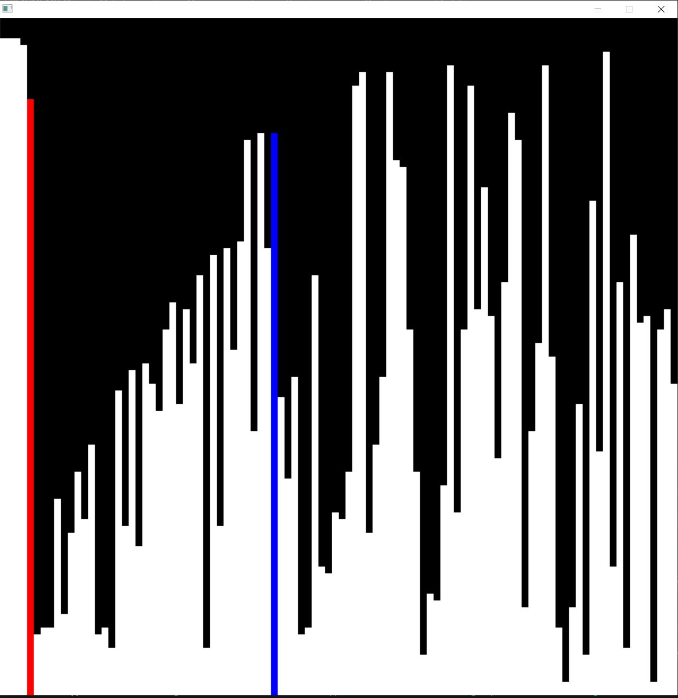

# Project 6: SortVisualizer In C++
# Overview
This project demonstrates various sorting algorithms visually by rendering sorting steps in real-time using the SDL2 library. It allows users to observe sorting algorithms in action through a graphical interface that highlights elements as they are compared and swapped during the sorting process.

The project provides flexibility to plug in different sorting algorithms, making it a useful tool for both educational purposes and performance analysis of sorting techniques.

## Demo  

> > 

## AI enhanced:
> > ai-main.cpp //refactor so that we can plug in different sorting algorithm. 

 

# Project Structure
•  main.cpp: Contains the main application logic, including sorting algorithms, SDL2 setup, rendering, and event handling.
•  draw_state function: Responsible for drawing the current state of the array on the screen and highlighting specific elements during sorting.

## Run Locally  

Clone the project  

~~~bash  
  git clone https://github.com/luongkhdang/Project-6--Project6SortVisualizer-In-Cpp--.git
~~~

Go to the project directory  

~~~bash  
  cd my-project
~~~

 
Requirement:
  SDL2 // SDL2 is included (lib and include folder)
  SDL2.dll in the same folder as the .exe

To Start:

~~~bash  
g++ -fdiagnostics-color=always -g "main.cpp" -o "main.exe" -I "/include" -L "/lib" -lmingw32 -lSDL2main -lSDL2 -mconsole 
~~~

Insert directory of main.cpp, main.exe, /include, and /lib.
For example:
~~~bash 
C:/msys64/ucrt64/bin/g++.exe -fdiagnostics-color=always -g "C:\PROGRAMMING\BIG PROJECT\SortVisualizer In Cpp\main.cpp" -o "C:\PROGRAMMING\BIG PROJECT\SortVisualizer In Cpp\main.exe" -I "C:/PROGRAMMING/BIG PROJECT/SortVisualizer In Cpp/include" -L "C:/PROGRAMMING/BIG PROJECT/SortVisualizer In Cpp/lib" -lmingw32 -lSDL2main -lSDL2 -mconsole 
~~~

## Features  

•  Visual Sorting: Observe sorting algorithms (e.g., Bubble Sort, Insertion Sort) step by step.
•  Dynamic Sorting Algorithms: Easily switch between different sorting algorithms.
•  Real-Time Updates: Visual feedback with color-coded highlights for comparisons and swaps.
•  Efficient Rendering: Utilizes SDL2 for smooth and efficient rendering of sorting steps.

# Prerequisites

Before working on this project, you should be familiar with the following concepts:
•	C++ Programming:
o	Basic syntax and structure
o	Object-oriented programming concepts
o	Use of STL (e.g., std::vector)
•	SDL2 Library:
o	Installing and setting up SDL2
o	Basic SDL2 concepts (window management, rendering, and event handling)

# What You'll Learn

By working on this project, you will develop skills in:
•	Graphics Programming with SDL2:
o	Setting up and managing an SDL2 window and renderer
o	Visualizing sorting algorithms by drawing dynamic lines representing array elements
•	Sorting Algorithms:
o	Implementing and understanding different sorting algorithms (e.g., Bubble Sort, Insertion Sort)
o	Analyzing the performance and behavior of these algorithms in real-time
•	Event Handling:
o	Managing user input and window events for smooth interactions
•	Code Optimization:
o	Optimizing sorting loops and rendering efficiently to minimize delays

## AI enhanced: 
* Using ChatGPT o1 to implement the following:

Using ChatGPT to refactor and optimize the following:
1.	Modular Sorting Functions: Created a flexible sorting function framework for plugging in different sorting algorithms.
2.	Bubble Sort and Insertion Sort implemented with real-time visualization.
3.	Rendering Enhancements: Added color-coded highlights to visually show elements being compared and swapped.
4.	Optimized Drawing: Improved SDL2 rendering to minimize flickering using double-buffering techniques.
5.	Flexible Algorithm Plug-in: Easily switch between different sorting algorithms with minimal changes to the core logic.

## License  

This project is licensed under the [MIT](https://choosealicense.com/licenses/mit/) License. Feel free to use, modify, and distribute it as you see fit.